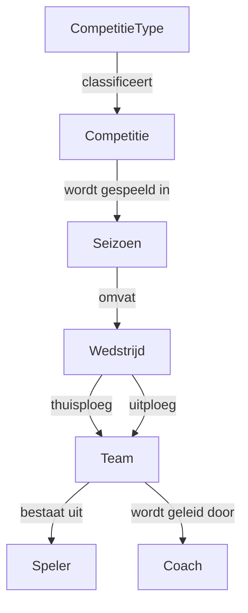

# Conceptueel Datamodel: Voetbalcompetities

## 1. Entiteiten

### Competitie
- **Definitie**: Een georganiseerde reeks van sportwedstrijden waarin meerdere teams strijden om een kampioenschap.
- **Attributen**:
  - **Naam**: De officiële naam van de competitie (bijv. 'Eredivisie').
    - **Type**: Tekst
    - **Bron**: `[AANNAME]` Gebaseerd op de noodzaak om competities uniek te identificeren.
  - **Land**: Het land waarin de competitie primair wordt gehouden.
    - **Type**: Tekst
    - **Bron**: `[AANNAME]` Competities zijn doorgaans nationaal georganiseerd.

### CompetitieType
- **Definitie**: Een classificatie die het niveau en de aard van een voetbalcompetitie bepaalt.
- **Attributen**:
  - **Naam**: De naam van het competitietype.
    - **Type**: Tekst
    - **Bron**: `[AANNAME]` Noodzakelijk voor identificatie van het type.
    - **Voorbeelden**: 'WK landen', 'Continent landen', 'Landelijke competitie', 'Landelijke beker', 'Continent ploegen'
  - **Niveau**: Het niveau binnen een categorie (bijv. voor Continent ploegen: 1 = Champions League, 2 = Europe League).
    - **Type**: Getal
    - **Bron**: `[AANNAME]` Sommige competitietypen hebben meerdere niveaus.
  - **Bereik**: Het geografische of organisatorische bereik (bijv. 'Wereldwijd', 'Continentaal', 'Nationaal').
    - **Type**: Tekst
    - **Bron**: `[AANNAME]` Definieert de scope van de competitie.

### Seizoen
- **Definitie**: Een specifieke periode, meestal een jaar, waarin een editie van een competitie plaatsvindt.
- **Attributen**:
  - **Startjaar**: Het jaartal waarin het seizoen begint.
    - **Type**: Getal
    - **Bron**: `[AANNAME]` Een seizoen overspant een gedefinieerde periode.
  - **Eindjaar**: Het jaartal waarin het seizoen eindigt.
    - **Type**: Getal
    - **Bron**: `[AANNAME]` Een seizoen overspant een gedefinieerde periode.

### Team
- **Definitie**: Een groep spelers die als eenheid deelneemt aan een competitie.
- **Attributen**:
  - **Naam**: De officiële clubnaam (bijv. 'Ajax').
    - **Type**: Tekst
    - **Bron**: `[AANNAME]` Noodzakelijk voor de identificatie van een team.
  - **Stad**: De stad waar het team gevestigd is.
    - **Type**: Tekst
    - **Bron**: `[AANNAME]` Teams hebben een geografische thuisbasis.

### Speler
- **Definitie**: Een individu dat als sporter deel uitmaakt van een team.
- **Attributen**:
  - **Volledige Naam**: De volledige naam van de speler.
    - **Type**: Tekst
    - **Bron**: `[AANNAME]` Noodzakelijk voor de identificatie van een speler.
  - **Geboortedatum**: De geboortedatum van de speler.
    - **Type**: Datum
    - **Bron**: `[AANNAME]` Standaard attribuut voor het registreren van personen.
  - **Nationaliteit**: De nationaliteit van de speler.
    - **Type**: Tekst
    - **Bron**: `[AANNAME]` Relevant voor internationale regels en statistieken.

### Coach
- **Definitie**: Een individu dat verantwoordelijk is voor het trainen en begeleiden van een team.
- **Attributen**:
  - **Volledige Naam**: De volledige naam van de coach.
    - **Type**: Tekst
    - **Bron**: `[AANNAME]` Noodzakelijk voor de identificatie van een coach.
  - **Geboortedatum**: De geboortedatum van de coach.
    - **Type**: Datum
    - **Bron**: `[AANNAME]` Standaard attribuut voor het registreren van personen.
  - **Nationaliteit**: De nationaliteit van de coach.
    - **Type**: Tekst
    - **Bron**: `[AANNAME]` Relevant voor internationale regels en statistieken.

### Wedstrijd
- **Definitie**: Een enkele wedstrijd tussen twee teams binnen de context van een competitie en seizoen.
- **Attributen**:
  - **Datum**: De datum en tijd waarop de wedstrijd wordt gespeeld.
    - **Type**: Datum
    - **Bron**: `[AANNAME]` Elke wedstrijd wordt op een specifiek moment gepland.
  - **Score Thuisploeg**: Het aantal doelpunten gescoord door het thuisspelende team.
    - **Type**: Getal
    - **Bron**: `[AANNAME]` De uitslag van de wedstrijd is een kerngegeven.
  - **Score Uitploeg**: Het aantal doelpunten gescoord door het uitspelende team.
    - **Type**: Getal
    - **Bron**: `[AANNAME]` De uitslag van de wedstrijd is een kerngegeven.

## 2. Relaties

- Een **Competitie** heeft één **CompetitieType**. (N-op-1)
- Een **CompetitieType** kan meerdere **Competities** hebben. (1-op-N)
- Een **Competitie** wordt gespeeld in meerdere **Seizoenen**. (1-op-N)
- Een **Seizoen** kent één **Competitie**. (1-op-1)
- Een **Team** kan in een **Seizoen** deelnemen aan een **Competitie**. (N-op-M, via `Wedstrijd`)
- Een **Team** bestaat uit meerdere **Spelers**. (1-op-N)
- Een **Speler** speelt voor één **Team**. (1-op-1, aanname: geen transfers binnen het model)
- Een **Team** wordt geleid door één **Coach**. (1-op-1)
- Een **Wedstrijd** wordt gespeeld tussen precies twee **Teams** (een thuisploeg en een uitploeg).
- Een **Wedstrijd** vindt plaats binnen één **Seizoen** van een **Competitie**.

## 3. Visualisatie

